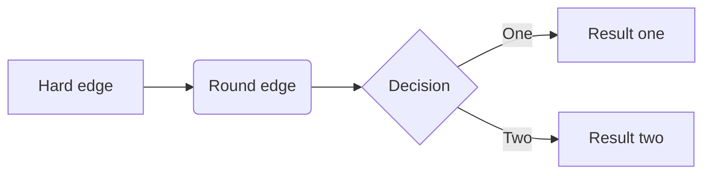

# Raspberry Pi for Computer Vision

## Deep Learning Frameworks

Popular deep learning frameworks include **Caffe**, **TensorFlow/Keras**, 
**PyTorch**, **MXNet**, and **CNTK**.

```mermaid
graph LR
A[Hard edge] -->B(Round edge)
    B --> C{Decision}
    C -->|One| D[Result one]
    C -->|Two| E[Result two]
```
